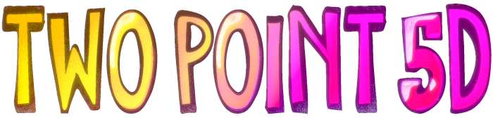
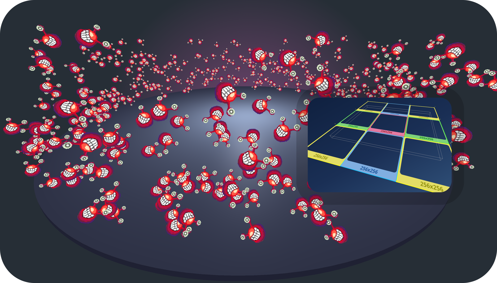

<p align="center">
  
  <br>
  <em>a 2.5d realtime gfx library built with three.js</em>
</p>

<div align="center">


[](https://opensource.org/licenses/Apache-2.0)

</div>



A collection of typescript classes and helper functions in the shape of a monorepo. Most of these are centered around building 2.5D games, demos and realtime gfx on the web platform.

:rocket: Some of the features are already quite stable, others are still experimental.

The library comes in two flavors:
- [twopoint5d](packages/twopoint5d) : based on _three.js_ and _vanilla js_ all the main features are inside here
- [twopoint5d-r3f](packages/twopoint5d-r3f) : based on _@react-three/fiber_ and offers all the features as _react_ components and hooks for those who prefer it in a more declarative way

## What are the goals of this project ?

- Make the creation of 2.5D games, demos and realtime gfx as easy and satisfying as possible
- Super easy import and use of gamedev assets and 2D resources from the internet
- First-class pixel-art support and responsive-design awareness

## What are the core features ?

- Creation, management and efficient display of 2.5D sprites/particles
  - texture-atlas support
  - sprite-sheet animations
  - billboards!
- Creation, management and display of 2.5D maps
- Import of common texture atlas formats (TexturePacker) and 2.5D-maps (tiled, LDtk)
  - _OK, to be honest: this point is still rather in the planning phase and not yet implemented, more like wok in progress_ :wink:
- Advanced api for extending and customizing sprite features and 2.5D-map renderers

:warning: However, there are currently no detailed tutorials or comprehensive documentation available - instead, there are
- a number of examples that illustrate the respective features and usage of the api
- some unsorted documents about selected features in the [docs/](docs/) directory

## Usage Examples

Almost all of these examples serve to show individual aspects and usage of the api. Therefore, don't expect any visual masterpieces at this point. This is given to the user of the libraries as an exercise :wink:

> At the moment a new [lookbook](./apps/lookbook/) app is being developed, which combines all examples. you can start it simply by:

```sh
$ npx nx dev lookbook  # or just use: npm start
```

But as long as not all examples have been migrated, the _old_ examples can still be found here:

- [examples/vanilla](./examples/vanilla/)
  - vanilla three.js examples (no build step required)
- [examples/r3f](./examples/r3f/)
  - examples for the usage of _twopoint5d_ components and hooks in a react context based on the fantastic _@react-three/fiber_

## Getting involved

Everyone is welcome to contribute to this project, no matter if it's just bug-fixes, new features, ideas or documentation or graphics!

### Development Setup

this repository is structured as a monorepo; based on [nx](https://nx.dev/) !

#### 1. Install dependencies

First, you need a current [node v18+](https://nodejs.org/) setup.
Install the dependencies with:

```sh
$ npm ci --force
```

#### 2. Build and test everything

```sh
$ npm run cbt  # => npm run clean && npm run build && npm test
```

#### 3. Run the local lookbook app

```sh
$ npm start
```

## Copyright and License

Copyright &copy; 2023 by Wolfger Schramm &lt;wolfger@spearwolf.de&gt;

The source code is licensed under the [Apache-2.0 License](./LICENSE).
