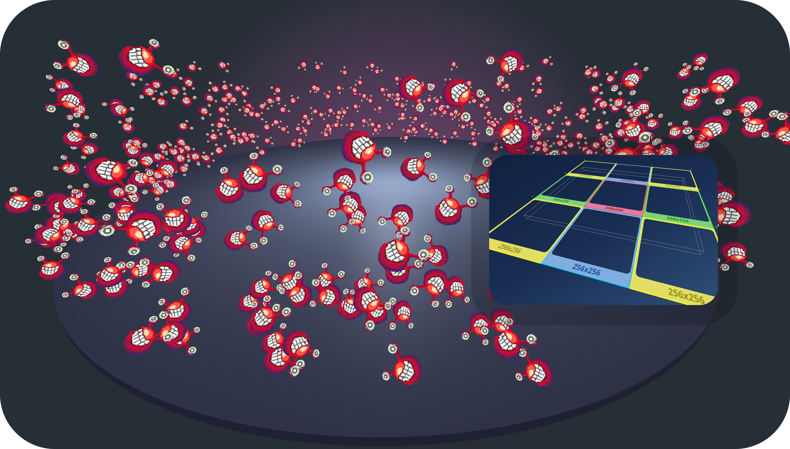

<p align="center">
  <picture>
    <source media="(prefers-color-scheme: dark)" srcset="apps/lookbook/src/images/twopoint5d-logo-next.svg">
    
  </picture>
  <br>
  <em>A javascript side project about rendering 2.5D realtime graphics on the web.</em>
</p>

<p align="center">
  <b>
    ultra fast rendering of 2D sprites in 3D space &bull; billboards &bull; texture atlas &bull; frame-based animations &bull; parallax &bull; tiled 2D maps &bull; pixelart
  </b>
</p>

<div align="center">


[](https://github.com/spearwolf/twopoint5d/actions/workflows/ci.yml)
[](https://opensource.org/licenses/Apache-2.0)

</div>



## Introduction

It all started with the desire to render 2d sprites (lots of them!) in the browser. it
has been a long way, starting with a naive html-canvas-based solution. the second
iteration used a custom webgl renderer, which turned out to be quite complex in the long
run. today, in its current form, the library uses three.js as the rendering layer.

A declarative description (called a "vertex object description") is used to describe the
sprite properties (how many vertices, indices, texture coords, etc.).

Using the _vertex object description_, the library can create javascript objects that
provide getters and setters for the respective sprite properties. the actual data ends
up in internal buffers that three.js renders efficiently in batches, usually via
instanced rendering — through its `WebGPURenderer`, which falls back to WebGL 2 where
WebGPU is missing.

While the developer can use the "sprites" / _vertex objects_ comfortably and
conveniently via javascript objects, the "backend" of the library ensures that the GPU
can render the current sprite pool with high performance with a single draw call. the
cumbersome handling of GPU buffers and state setup becomes transparent for the
developer.

Whether a "sprite" is a classic quad with a texture or a freeform polygon with special
properties read by a custom material is completely up to the creator of the vertex
object description and of the material that uses those properties — a three.js
`NodeMaterial` whose shader is written in TSL (`three/tsl`).

> :rocket: In other words, this library wants to empower the developer's creativity by
> allowing him to quickly and easily create his own sprites, particles or whatever using
> instanced rendering and his own custom shaders, without having to study the
> documentation every time to understand the boring details of WebGPU and WebGL.

Of course, this library offers several ready-to-use sprite shaders (better known as
`Mesh` in three.js) based on this. the developer can just use them and doesn't have to
worry about how.

There are sprite shaders that render textured quads as billboards or on a plane in the
3d space. there is also a sprite shader that uses animated textures (using frame-based
animations). and there are other highly specialized sprite shaders that are used for
rendering tiled 2d maps, among other things.

Obviously, textures can be loaded from _texture atlases_ or _tilesets_.

> ‼️ However, the developer should not expect an all-encompassing sprite engine, that is
> not the intention of this library, it rather wants to reduce and speed up the
> developer's workload to do what he wants to do (but without hiding the rendering API
> three.js).

_There are a few more features that this library offers to make the life of a creative
web developer easier, but not to take all the fun out of discovering them, let's just
mention them here_ :wink:

## What's in this repository 👀

_twopoint5d_ is a monorepo that contains the following javascript / typescript
libraries:

- [@spearwolf/twopoint5d](packages/twopoint5d) : is the "vanilla" core library and
  relies on [three.js](https://threejs.org/) as a rendering framework

## Usage

```sh
npm install @spearwolf/twopoint5d three @spearwolf/eventize @spearwolf/signalize
```

`three`, `@spearwolf/eventize` and `@spearwolf/signalize` are peer dependencies: the
application installs them next to the library. `three` has to lie in the peer range of
the installed release, which `npm view @spearwolf/twopoint5d peerDependencies` prints —
the library follows the 0.x minors of three.js one at a time, and a `three` outside that
range is a peer conflict. A TypeScript project adds `@types/three` from the same range
as a development dependency; it is the one optional peer.

The library renders through the `WebGPURenderer` of three.js, which falls back to WebGL
2 where the browser has no WebGPU; a `WebGLRenderer` is not supported. Import three.js
from `three/webgpu` and its shader nodes (TSL) from `three/tsl`, as the library itself
does.

One textured sprite, drawn by a `Display` with a scene and a camera of its own:

```ts check
import {Display, TextureFactory, TexturedSprites} from '@spearwolf/twopoint5d';
import {PerspectiveCamera, Scene} from 'three/webgpu';

// the display owns the renderer and drives the frame loop
const display = new Display(document.getElementById('canvas')!);

const scene = new Scene();
const camera = new PerspectiveCamera(60);

display.onResize(({width, height}) => {
  camera.aspect = width / height;
  // the field of view is vertical: a window taller than wide moves the camera back, so
  // the sprite fits across as well
  camera.position.z = 400 / Math.min(1, camera.aspect);
  camera.updateProjectionMatrix();
});

display.onInit(async ({renderer}) => {
  const texture = await new TextureFactory(renderer).loadAsync('sprite.png');

  // a dispose() while the image loaded has gone out already, and an onDispose() from
  // here on would never hear it
  if (display.isDisposed) {
    texture.dispose();
    return;
  }

  // a mesh with room for one sprite, drawn with the texture
  const sprites = new TexturedSprites(1, texture);

  const sprite = sprites.createSprite()!;
  sprite.setSize(256, 256);
  // s, t, u, v: the whole image
  sprite.setTexCoords(0, 0, 1, 1);

  // upload what the sprite wrote into the buffers of the mesh
  sprites.update();
  scene.add(sprites);

  display.onDispose(() => {
    // the mesh releases the material it built around the texture; the texture is yours
    sprites.dispose();
    texture.dispose();
  });
});

display.onRenderFrame(({renderer}) => renderer.render(scene, camera));

await display.start();
```

`#canvas` is a `<canvas>` on the page, or an element the display puts a canvas into. The
same sprite, with a frame of a texture atlas in place of the whole image, is the first
demo of the [lookbook](apps/lookbook/) — [its
source](apps/lookbook/src/pages/demos/first-sprite.astro); in a clone of this
repository, `pnpm lookbook` serves it at
<http://localhost:4321/lookbook/demos/first-sprite>. From there:

- [Stage layer cheat-sheet](packages/twopoint5d/src/stage/README.md) — projections,
  several stages in one frame, post-processing
- [Vertex objects](packages/twopoint5d/src/vertex-objects/README.md) — what a vertex
  object description declares, for sprites of your own
- [Resource lifecycle](packages/twopoint5d/docs/resource-lifecycle.md) — what
  `dispose()` releases and what stays yours

## 📖 Documentation

Some features have been around for a long time and are stable, others are in flux and
highly experimental. as an independent solo developer, it is not possible for me to
create detailed written documentation and keep it up to date. this is a living open
source project and is subject to constant change. therefore, the developer is advised to
do the following

> _"Read the source, Luke!"_

To take this to the extreme, there is a LOOKBOOK app with lots of code examples, all of
which can be used as a starting point for new projects or as documentation for one or
the other feature.

> :rocket: The LOOKBOOK app can easily be started locally using `pnpm lookbook`. See
> next section [Development Setup](#development-setup) for details.

And of course there are one or two READMEs in the `**/src/*` subdirectories that provide
a high-level overview of the features. _Enjoy exploring!_


## Development Setup

This repository is structured as a monorepo; based on [nx](https://nx.dev/) !

### 1. Install dependencies

First, you need [node](https://nodejs.org/) `^24.16.0 || >=26.3.0` — a 24.16 or newer,
or a 26.3 or newer; the 25.x line is out — and [pnpm](https://pnpm.io/) `>=10.22.0`,
both ranges as `engines` in the root `package.json` states them. An `.nvmrc` and a
`mise.toml` are checked in, both naming `24`, so `nvm install`,
`fnm use --install-if-missing` or `mise install` fetches the newest 24.x for you.
Install the dependencies with:

```sh
$ pnpm install
```

The browser tests in `pnpm cbt` need Chromium and Firefox from Playwright.
`pnpm install` does not download them, so fetch them once, and again after every
Playwright bump (on Linux, add `--with-deps` if system libraries are missing):

```sh
$ pnpm exec playwright install chromium firefox
```

### 2. Build and test everything

```sh
# clean, lint, build, type-check, check the package types and that every published
# type can be named, lint the manifest, then the script tests, the Vitest suite with
# coverage, the allocation specs and the browser tests
$ pnpm cbt
```

### 3. Run the local LOOKBOOK app

```sh
$ pnpm lookbook
```

## Getting involved

Everyone is welcome to contribute to this project, no matter if it's just bug-fixes, new
features, ideas or documentation or graphics!


## Copyright and License

Copyright &copy; 2021-2026 by [Wolfger
Schramm](mailto:wolfger@spearwolf.de?subject=[GitHub]%20twopoint5d).

The source code is licensed under the [Apache-2.0 License](./LICENSE).
