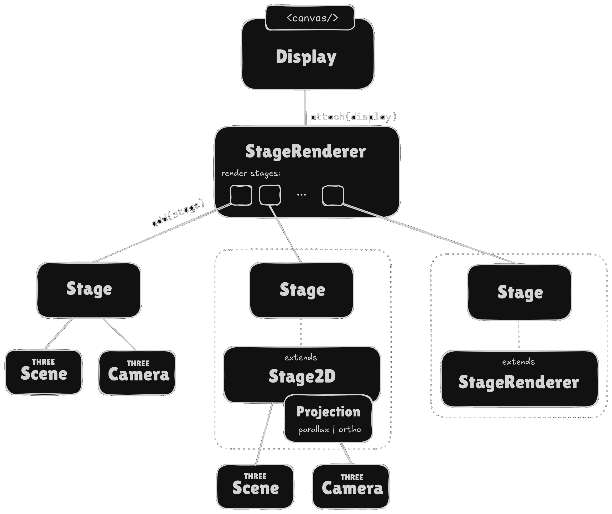

# Display

The `Display` class is a convenience helper in `twopoint5d`. It simplifies the process of initializing an HTML canvas element, setting up a `three.js` renderer, and starting a render loop.

::: info
**Using the `Display` class is optional.** All core features of `twopoint5d`, such as Vertex Objects, Tiled Maps, or Sprites, can be used directly with a `three.js` renderer without this class.
:::

## Introduction

The `Display` class abstracts away recurring tasks when setting up a `three.js` scene. It handles:

-   **Canvas Creation:** Automatically creates a `<canvas>` element within a specified DOM container or uses an existing one.
-   **Renderer Management:** Initializes a `WebGLRenderer` (or optionally a `WebGPURenderer`) and automatically resizes it to fit the parent element.
-   **Render Loop:** Provides an optimized `requestAnimationFrame` loop that can be used for animations and interactions. The frame rate can be controlled via the `maxFps` option in the constructor or the `frameLoop` property.
-   **Event System:** Offers a robust event system (based on [eventize](https://github.com/spearwolf/eventize)) for lifecycle and render events.
-   **Time Management:** Keeps track of the elapsed time and the time delta between frames.
-   **State Management:** Internally manages the display's state (e.g., `running`, `paused`).

A typical use case is the rapid creation of a prototype or demo without having to worry about the details of renderer configuration.

## State Model

The `Display` class uses an internal state machine ([DisplayStateMachine](https://github.com/spearwolf/twopoint5d/blob/main/packages/twopoint5d/src/display/DisplayStateMachine.ts)) to manage its lifecycle.


::: warning
The automatic pause and restart based on _document visibility_ and on the `IntersectionObserver` is planned for a future version and is not yet implemented.
:::

The main states are:

-   `'new'`: The initial state before `start()` is called.
-   `'running'`: The render loop is active, and the scene is being drawn.
-   `'paused'`: The render loop is suspended.

The state changes automatically under the following conditions:

An explicit call to ..
-   `display.start()` or `display.stop()`
-   `display.pause()` or setting `display.pause = true`
-   `display.dispose()`


## Declarative Resizing with `resize-to`

The `Display` class offers an optional declarative way to control the canvas size using the custom `resize-to` HTML attribute. This allows you to manage layout behavior directly in your HTML, separating it from your JavaScript logic.

By default, `Display` inspects the `<canvas>` element itself for this attribute. You can change which element is inspected by providing the `resizeToAttributeEl` option to the constructor.

The `resize-to` attribute can have the following values:

-   **`"fullscreen"`** or **`"window"`**: The canvas will be resized to fill the entire browser window. `Display` will automatically add the necessary CSS styles (`position: fixed`, etc.) to achieve this.
    ```html
    <canvas resize-to="fullscreen"></canvas>
    ```

-   **A CSS Selector**: You can provide any valid CSS selector. The canvas will be resized to match the content area of the first element found by that selector.
    ```html
    <div id="render-area" style="width: 800px; height: 600px;"></div>
    <canvas resize-to="#render-area"></canvas>
    ```
    > Note: Only the size is synchronized; the position of the canvas is _not_ adjusted to the element.

-   **`"self"`**: The canvas will be resized to fit the dimensions of its own containing element (taking into account the `resizeToElement` option). This is the default, no need to be set explicitly.

This mechanism provides a flexible alternative to the programmatic `resizeTo` and `resizeToElement` options. The order of precedence is:
1. `resizeTo` callback function (if provided)
2. `resize-to` attribute
3. `resizeToElement` option

## Examples

The `Display` class can be used independently, but is also suitable as a basis for more complex rendering configurations. The following examples demonstrate how to use it in combination with `Stage2D` and `StageRenderer`.

### Basic Display Setup

Here is a minimal example of how to use the `Display` class to set up a `three.js` scene. It creates a renderer, a camera, and a scene and handles the render loop and resizing.

```jsx
import * as THREE from 'three';
import { Display } from '@spearwolf/twopoint5d';

const display = new Display( document.getElementById( "twopoint5d" ) );

let camera, scene;

display.onInit(({ renderer, width, height }) => {
    camera = new THREE.PerspectiveCamera( 70, width / height, 1, 1000 );
    camera.position.z = 400;

    scene = new THREE.Scene();
});

display.onResize(({ width, height }) => {
    camera.aspect = width / height;
    camera.updateProjectionMatrix();
});

display.onRenderFrame(({ renderer }) => {
    renderer.render( scene, camera );
});

display.start();
```

### Using Display with Stage2D and Projections

A `Stage2D` represents a two-dimensional scene with a camera that is automatically managed by a `Projection`. This example shows how to combine `Display` with a `Stage2D` and a `ParallaxProjection` to create a simple 2.5D setup.

```javascript
import { Display, Stage2D, ParallaxProjection } from "@spearwolf/twopoint5d"

const projection = new ParallaxProjection("xy|bottom-left", {
    width: 640,
    height: 480,
    fit: "contain",
    minPixelZoom: 2
});

const stage = new Stage2D(projection);

const display = new Display(document.querySelector("canvas"));

display.onResize(({ width: canvasWidth, height: canvasHeight }) => {
    stage.resize(canvasWidth, canvasHeight);
});

display.onRenderFrame(({ renderer }) => {
    renderer.render(stage.scene, stage.camera);
});

display.start();
```

### Managing Multiple Stages with StageRenderer

For more complex scenes with multiple layers (e.g., background, main scene, foreground), the `StageRenderer` is the perfect tool. It manages one or more `Stage2D` instances and handles their rendering order automatically.

```javascript
import * as THREE from 'three';
import { Display, Stage2D, StageRenderer, OrthographicProjection } from "@spearwolf/twopoint5d";

const projection = new OrthographicProjection("xy|bottom-left", {
    fit: 'contain',
    width: 320
});

const stage = new Stage2D(projection);

const display = new Display(document.querySelector("canvas"));

const stageRenderer = new StageRenderer(display);
stageRenderer.clearColor = new THREE.Color(0x4800f0);
stageRenderer.add(stage);

display.start();
```

## Relationship between Display, Stage and StageRenderer



## Public API

### `constructor(domElementOrRenderer, options?)`

-   `domElementOrRenderer`: Either an `HTMLElement` (like `div` or `canvas`) to serve as a container, or a pre-existing `WebGLRenderer` or `WebGPURenderer` instance.
-   `options` (optional): An object with configuration parameters.
    -   `createRenderer`: A custom function `(params) => renderer` to create the renderer instance. Useful for advanced configurations or custom renderers.
    -   `maxFps`: Limits the maximum frame rate (e.g., `30`). Defaults to `0` (unlimited).
    -   `resizeTo`: A callback function `(display: Display) => [width: number, height: number]` to manually control the canvas size. This overrides `resizeToElement`.
    -   `resizeToElement`: An `HTMLElement` whose size the canvas should adopt. Defaults to the container element if one is provided.
    -   `resizeToAttributeEl`: The `HTMLElement` from which the `resize-to` attribute is read. Defaults to the canvas element itself. This allows for dynamic resizing based on a declarative attribute.
    -   `styleSheetRoot`: The DOM element or ShadowRoot where internal CSS rules are injected. Defaults to `document.head`.
    -   ... as well as all other options accepted by the `three.js` `WebGLRenderer` constructor (e.g., `antialias`, `alpha`, `powerPreference`).

### Properties

-   `width: number` (read-only): The current width of the canvas in CSS pixels.
-   `height: number` (read-only): The current height of the canvas in CSS pixels.
-   `now: number` (read-only): The total time in seconds since the display started.
-   `deltaTime: number` (read-only): The time in seconds that has passed since the last frame.
-   `frameNo: number` (read-only): The current frame number.
-   `isFirstFrame: boolean` (read-only): `true` if the current frame is the first one.
-   `pause: boolean`: Sets or gets the paused state of the display.
-   `pixelRatio: number` (read-only): The effective pixel ratio of the renderer.
-   `devicePixelRatio: number` (read-only): The browser's `devicePixelRatio`.
-   `pixelZoom: number`: A factor for scaling pixels, useful for pixel art. If greater than 0, `devicePixelRatio` is ignored.
-   `renderer: WebGLRenderer | WebGPURenderer`: The `three.js` renderer instance.

### Methods

-   `start(beforeStartCallback?)`: Starts the render loop. Can invoke an async function `beforeStartCallback` before the first frame is rendered.
-   `stop()`: Pauses the render loop.
-   `dispose()`: Stops the loop, removes all event listeners, and releases the renderer's resources.
-   `resize()`: Forces a recalculation of the canvas size. Usually called automatically.
-   `getEventProps()`: Returns an object with the current event properties that are passed to event handlers.

### Extending the Display Class

In practice, it is often useful to create specialized classes that inherit from `Display` to build reusable components.

The *lookbook* application, for instance, uses a [PerspectiveOrbitDemo](https://github.com/spearwolf/twopoint5d/blob/main/apps/lookbook/src/demos/utils/PerspectiveOrbitDemo.ts) class that comes pre-configured with a `PerspectiveCamera` and `OrbitControls`.

This pattern encapsulates the setup logic and makes it easy to create consistent demos.

## Events

The `Display` class is an *eventized* object and provides several lifecycle events. You can listen to them using `on(display, EventName, handler)` or any other methods provided by the [eventize](https://github.com/spearwolf/eventize) library.

| Event Name | as Module Export | Description |
|------------|------------------|-------------|
| _"init"_ | `OnDisplayInit` | Fired once after initialization. |
| _"start"_ | `OnDisplayStart` | Fired when the render loop starts. |
| _"pause"_ | `OnDisplayPause` | Fired when the loop is paused. |
| _"restart"_ | `OnDisplayRestart` | Fired on restart after a pause. |
| _"resize"_ | `OnDisplayResize` | Fired when the canvas size changes. |
| _"renderFrame"_ | `OnDisplayRenderFrame` | Fired on every frame before rendering. This is the main hook for application logic. |
| _"dispose"_ | `OnDisplayDispose` | Fired when `display.dispose()` is called. |

### Event Handler Shortcuts

Convenience shortcut methods are available for the most important events:

-   `onInit(handler)`
-   `onStart(handler)`
-   `onPause(handler)`
-   `onRestart(handler)`
-   `onResize(handler)`
-   `onRenderFrame(handler)`
-   `onNextFrame(handler)` (fires the handler only once on the next frame)
-   `nextFrame()`: Returns a `Promise` that resolves on the next frame.
-   `onDispose(handler)`