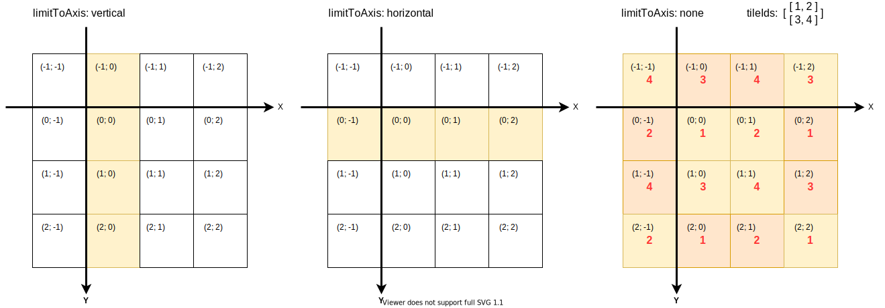
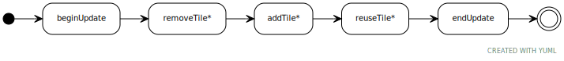

# Map2D: Creating Tile-Based 2D-Worlds

The `Map2D` module in the `@spearwolf/twopoint5d` package provides a powerful and flexible system for creating and rendering 2D tile-based maps. This guide will walk you through the core concepts, from the basic structure of a tile map to advanced rendering techniques.

## Overview: The Anatomy of a 2D Map

At its core, a tile-based map is a grid of tiles. In `twopoint5d`, this concept is broken down into several key components that work together:

1.  **`Map2DLayer`**: This is the central organizational unit. The class represents a single layer of your 2D map and manages a grid of tiles. You can have multiple layers to create depth and complex scenes (e.g., a background layer, a main gameplay layer, and a foreground layer).

2.  **Tile Data Provider (`IMap2DTileDataProvider`)**: This component is responsible for supplying the tile data—specifically, the ID of the tile at any given `(x, y)` coordinate in the grid. It acts as the "source of truth" for your map's content.

3.  **Visibility Manager (`IMap2DVisibilitor`)**: This determines which tiles of a `Map2DLayer` are currently visible to the camera. This is crucial for performance, as it ensures that only the necessary tiles are processed and rendered at any given time (a technique known as culling).

4.  **Tile Renderer (`IMap2DTileRenderer`)**: This component handles the actual drawing of the visible tiles. It takes the tile data and translates it into visual geometry that can be rendered by `three.js`.

This modular architecture allows you to mix and match different components to suit your specific needs.


## 1. Defining the Map Content: Tile Data Providers

The first step in creating a map is to define its content. This is done using a class that implements the `IMap2DTileDataProvider` interface. This interface has only two methods:
- `getTileIdAt(col, row): number` → which returns the ID of the tile at the specified grid coordinates. A tile ID of `0` signifies an empty space.
- `getTileIdsWithin(left, top, width, height, target?: Uint32Array): Uint32Array`→ which returns a block of tile IDs within the specified rectangle. This is useful for efficiently retrieving multiple tiles at once.

`twopoint5d` comes with a convenient, ready-to-use provider:

### `RepeatingTilesProvider`

This provider is perfect for creating infinitely repeating backgrounds or patterns. You give it a 2D array of tile IDs, and it will repeat that pattern endlessly in all directions.



**Example: Creating a repeating pattern**

```javascript
import { RepeatingTilesProvider } from '@spearwolf/twopoint5d';

// Creates a 2x2 pattern of tiles that will repeat indefinitely.
const tileProvider = new RepeatingTilesProvider([
  [1, 2], // Row 1
  [3, 4], // Row 2
]);

// Get the tile ID at a specific coordinate
const tileId = tileProvider.getTileIdAt(10, 5); // Will be calculated based on the repeating pattern
```

### Creating a Custom Data Provider

For more complex maps, such as those loaded from a level editor or generated procedurally, you can create your own data provider by implementing the `IMap2DTileDataProvider` interface.

```typescript
import { IMap2DTileDataProvider } from '@spearwolf/twopoint5d';

class MyCustomMapProvider implements IMap2DTileDataProvider {
  private mapData: number[][];

  constructor(levelData: number[][]) {
    this.mapData = levelData;
  }

  getTileIdAt(col: number, row: number): number {
    if (this.mapData[row] && this.mapData[row][col]) {
      return this.mapData[row][col];
    }
    return 0; // Return 0 for empty or out-of-bounds tiles
  }

  getTileIdsWithin(left: number, top: number, width: number, height: number, target?: Uint32Array): Uint32Array {
    // ... implementation to return a block of tiles
  }
}
```

## 2. Determining What's on Screen: Visibility Managers

Once you have the map data, you need to decide which part of it is _visible_. This is the job of the `IMap2DVisibilitor`. It calculates the set of tiles that fall within the camera's view.

`twopoint5d` provides two main visibility managers:

### `RectangularVisibilityArea`

This is the simplest visibility manager. It defines a fixed-size rectangular 2D area. Any tiles that fall within this rectangle are considered visible. This is useful for 2D games where the camera follows the player within a defined 2D viewport.

### `CameraBasedVisibility`

This is a more advanced visibility manager designed for 3D scenes where the `Map2DLayer` is placed on a 3D plane (like an endless floor or a wall). It uses the camera's view frustum to determine which tiles are visible. This allows for dynamic and perspective-correct culling in a 3D world.


## 3. Putting It All Together: The `Map2DLayer`

The `Map2DLayer` is where you combine your data provider and visibility manager. It acts as a `Object3D`, so you can add it directly to your scene.

**Example: Setting up a `Map2DLayer`**

This example from the `lookbook` shows how to create a `Map2DLayerObject3D` and configure it:

```javascript
import {
  Map2DLayerObject3D,
  RepeatingTilesProvider,
  RectangularVisibilityArea,
  Map2DTileSprites,
  TileSetLoader,
} from '@spearwolf/twopoint5d';
import { Scene } from 'three';

const scene = new Scene();

// 1. Create the layer
const mapLayer = new Map2DLayerObject3D();
mapLayer.tileWidth = 256;
mapLayer.tileHeight = 256;

// 2. Assign a visibility manager
mapLayer.visibilitor = new RectangularVisibilityArea(640, 480);

// 3. Create a tile renderer (more on this below)
const tileRenderer = new Map2DTileSprites();

// 4. Assign a data provider to the renderer
tileRenderer.tileData = new RepeatingTilesProvider([ [1, 2], [3, 4] ]);

// 5. Load the tile graphics
const { tileSet, texture } = await new TileSetLoader().loadAsync(/*...*/);
tileRenderer.tileSet = tileSet;
tileRenderer.material.uniforms.colorMap.value = texture;

// 6. Add the renderer to the layer
mapLayer.add(tileRenderer);
mapLayer.addTileRenderer(tileRenderer);

// 7. Add the layer to the scene
scene.add(mapLayer);

// 8. In your render loop, update the layer
function animate() {
  mapLayer.update();
  // ... render scene
}
```

## 4. Rendering the Tiles: The `IMap2DTileRenderer`

The final piece of the puzzle is the renderer. The `Map2DLayer` delegates the actual drawing of tiles to an object that implements the `IMap2DTileRenderer` interface. This interface defines methods that the layer calls when tiles need to be added, removed, or reused.



- `beginUpdate()`: Called at the start of an update cycle.
- `addTile(tile)`: Called when a new tile becomes visible.
- `reuseTile(tile)`: Called for a tile that was already visible and remains visible.
- `removeTile(tile)`: Called when a tile is no longer visible.
- `endUpdate()`: Called at the end of an update cycle.


### `Map2DTileSprites`: The Go-To Renderer

`twopoint5d` includes the `Map2DTileSprites`, a highly optimized renderer that uses instancing (`TileSprites`) to draw a large number of tiles. It's the recommended renderer for getting started quickly.

### Creating a Custom Tile Renderer

You can create a custom renderer to achieve unique visual effects or to integrate with other rendering systems. For example, you could create a renderer that uses `three.js` `CSS2DObject`s instead of `Mesh`es.

```typescript
import { IMap2DTileRenderer, Map2DTile } from '@spearwolf/twopoint5d';
import { Object3D, Vector2, Vector3 } from 'three';

class MyCustomTileRenderer extends Object3D implements IMap2DTileRenderer {
  private activeTiles = new Map<string, MyTileObject>();

  beginUpdate(offset: Vector2, translate: Vector3) {
    this.position.set(offset.x + translate.x, translate.y, offset.y + translate.z);
  }

  addTile(tile: Map2DTile) {
    const tileObject = new MyTileObject(tile); // Your custom tile object
    this.activeTiles.set(tile.id, tileObject);
    this.add(tileObject); // Add it to the scene graph
  }

  reuseTile(tile: Map2DTile) {
    // The tile is still visible, maybe update its position if needed
    const tileObject = this.activeTiles.get(tile.id);
    if (tileObject) {
      tileObject.position.set(tile.view.left, 0, tile.view.top);
    }
  }

  removeTile(tile: Map2DTile) {
    const tileObject = this.activeTiles.get(tile.id);
    if (tileObject) {
      this.remove(tileObject); // Remove from scene graph
      this.activeTiles.delete(tile.id);
      // Optional: dispose geometry/material
    }
  }

  endUpdate() {
    // Post-update logic, if any
  }

  // ... other required methods: resetTiles, dispose
}
```
