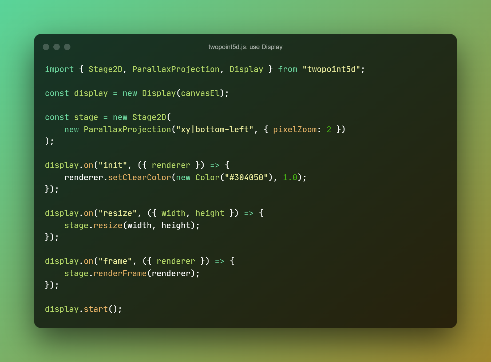
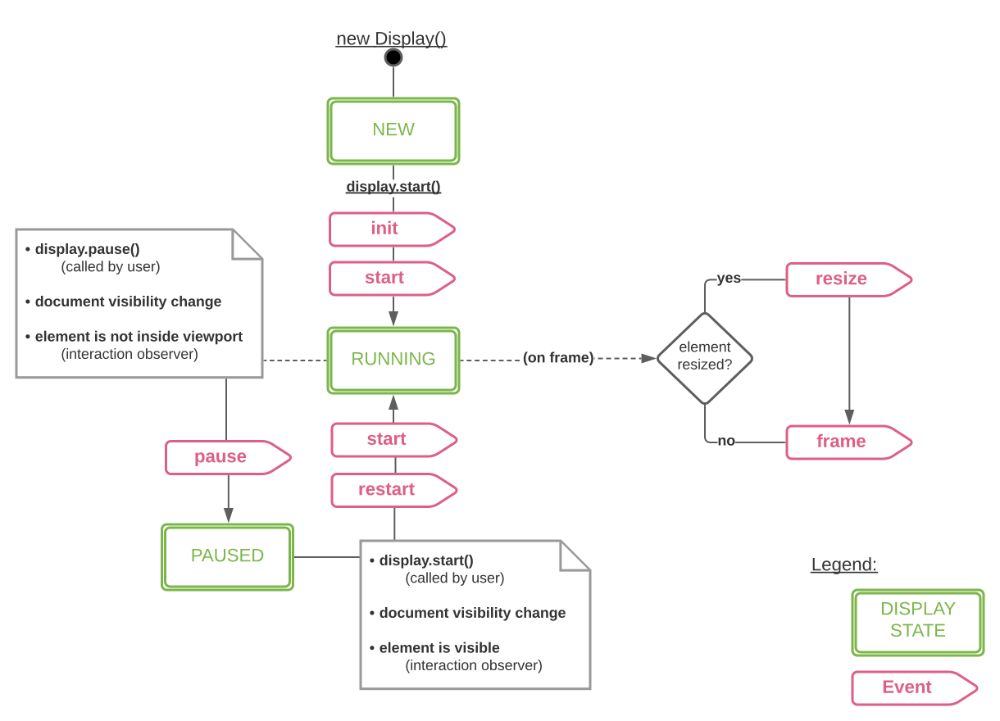

*twopoint5d.js*
# Display

- cosy boilerplate for creating a three.js `<canvas>` and dealing with the _init_, _resize_ and _frame_ event&#x2011;loop
- nice starting point for your three.js demos
- :heavy_check_mark: api is stable and ready to use

## Quickstart

More examples can be found here:
- [stage2d](../examples/vanilla/stage2d.html)
- [multiple displays](../examples/vanilla/display.html)
- [persepective orbit demo](../examples/vanilla/jsm/display/PerspectiveOrbitDemo.js)

## State and Events

> NOTE(2022-03-15): all states and transitions from the diagram are implemented -
_except_ the _element-is-inside-viewport_ check -
the feature hasn't been built yet and actually hasn't been thought through to the end of whether it's needed at all.

