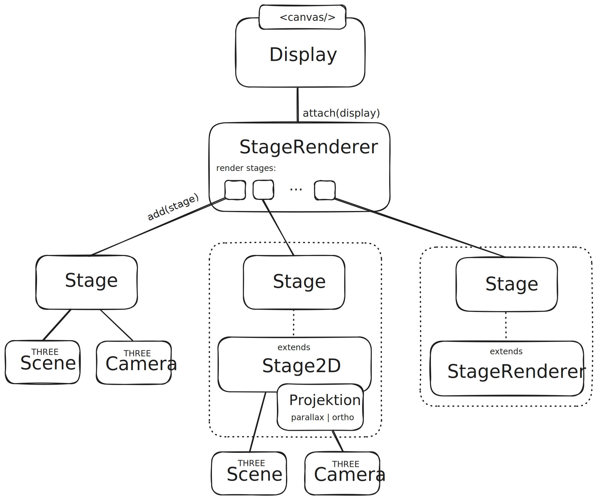

# Display, Stage and Projections



##  Display

The __Display__ class is a simple way to create a _three.js_ rendering context based on an HTML element. It handles resizing and the frame loop and provides a powerful and convenient event-based interface to the user.

```jsx
<canvas id="twopoint5d" resize-to="window"></canvas>

const display = new Display( document.getElementById( "twopoint5d" ) );

let camera, scene, renderer;

display.on({

    init ({ renderer, width, height }) {

        camera = new THREE.PerspectiveCamera( 70, width / height, 1, 1000 );
        camera.position.z = 400;

        scene = new THREE.Scene();

    }

    resize ({ width, height }) {

        camera.aspect = width / height;
        camera.updateProjectionMatrix();

    }

    renderFrame ({ renderer }) {

        renderer.render( scene, camera );

    }

})

display.start()
```

> [!NOTE]
> The library [@spearwolf/eventize](https://github.com/spearwolf/eventize) is used for event handling


## Stage and Projection

A __Stage__ is the combination of a _Scene_ and a _Camera_. The __Stage2D__ automatically generates a _Camera_ based on the specification of a _parallax_ or _orthographic_ projection.

A __Projection__ is always embedded in a 2D container (usually the display canvas). Based on the projection specification and the 2D container dimensions, a camera is automatically created and updated if the container size changes later.

In the current implementation, there is a __ParallaxProjection__ and one __OrthographicProjection__.

```js
import { Display, Stage2D, ParallaxProjection } from "@spearwolf/twopoint5d"

const projection = new ParallaxProjection("xy|bottom-left", {
    width: 640,
    height: 480,
    fit: "contain",
    minPixelZoom: 2
})

const stage = new Stage2D(projection)

stage.scene  // => THREE.Scene

const display = new Display(document.querySelector("canvas"))

display.on({
    resize({ width: canvasWidth, height: canvasHeight }) {
        stage.resize(canvasWidth, canvasHeight)
        
        // the effective dimension, may or may not be equal to the container,
        // depending on the projection specs and the container dimension
        stage.width
        stage.height

        stage.camera // => THREE.PerspectiveCamera is automatically generated by ParallaxProjection
    },

    renderFrame({ renderer }) {
        renderer.render(stage.scene, stage.camera)
    }
})

display.start()
```

### StageRenderer

The __StageRenderer__ can manage one or more stages and, in addition to the resizing, also handles the rendering of the stages.

The _StageRenderer_ is also the go-to place when it comes to __post-processing__, __render-to-texture__, or __transitioning__ from stages to other stages.


```js
import { Display, Stage2D, StageRenderer, OrthographicProjection } from "@spearwolf/twopoint5d"

const projection = new OrthographicProjection("xy|bottom-left", {
    fit: 'contain',
    width: 320
})

const stage = new Stage2D(projection)

const display = new Display(document.querySelector("canvas"))

const stageRenderer = new StageRenderer(display)
stageRenderer.clearColor = new THREE.Color(0x4800f0)
stageRenderer.add(stage)

display.start()
```
