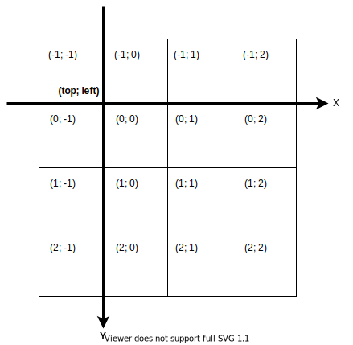
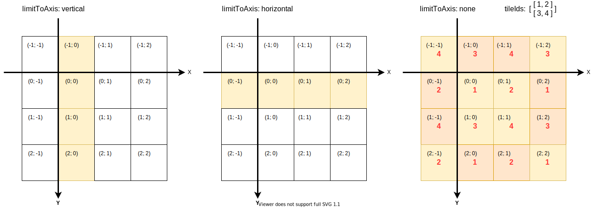
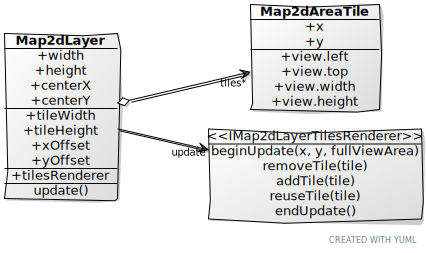
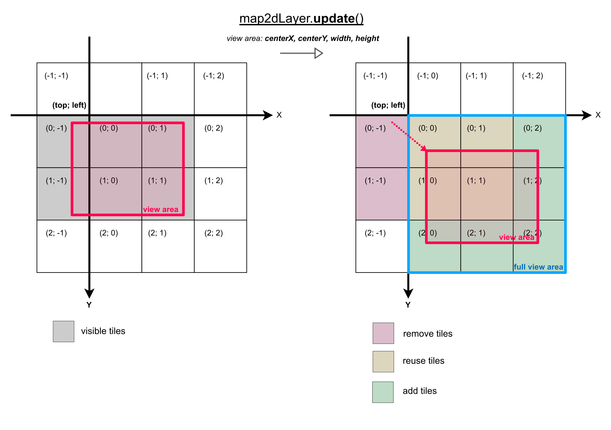
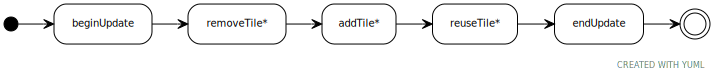

*twopoint5d.js*
# Map2D

> Create and render visual tiled maps which are laid out in a 2D spatial grid map data structure

Examples can be found here:
- [tiled-maps-basic-layer-tiles-renderer](../examples/vanilla/tiled-maps-basic-layer-tiles-renderer.html) (vanilla)
- [map2d-tile-sprites](../examples/r3f/src/map2d-tile-sprites/map2d-tile-sprites.jsx) (react)
- [map2d-tile-sprites-layer](../examples/r3f/src/map2d-tile-sprites-layer/map2d-tile-sprites-layer.jsx) (react)
- [map2d-camera-based-visibility](../examples/r3f/src/map2d-camera-based-visibility/map2d-camera-based-visibility.jsx) (react)

## A Grid of Tiles

### Tiled Maps

All tiles are generally determined by a numerical (`uint32`) ID.
For simplicity, it is assumed that the tiles are located in a 2D coordinate system.

#### The Source of the Tile IDs

The tile IDs are read out via the [IMap2DTileDataProvider](../packages/twopoint5d/src/tiledMaps/IMap2DTileDataProvider.ts) interface.

Tile IDs start at `1` and are unsigned integers, where `0` means there is no tile there.

##### RepeatingTilesProvider

The [RepeatingTilesProvider](../packages/twopoint5d/src/tiledMaps/RepeatingTilesProvider.ts) is an easy to use tile data provider which repeats a 2D pattern of tile IDs endlessly.
Very handy when you just want a constantly repeating background.

If you want you can limit the repeat to only horizontal or only vertical.

#### From Tile to 2D Coordinates

The [Map2DTileCoordsUtil](../packages/twopoint5d/src/tiledMaps/Map2DTileCoordsUtil.ts) does the mapping from 2D _world_ coordinates to _tile_ coordinates.

the origin of the 2D coordinate system is assumed to be in the upper left corner (with the y-axis pointing down).

#### Map2DLayer

In a [Map2DLayer](../packages/twopoint5d/src/tiledMaps/Map2DLayer.ts), the world is divided into a static grid with [tiles](../packages/twopoint5d/src/tiledMaps/Map2DTile.ts) of equal size.
Which tiles are displayed is determined by the _view area_ (which is an [AABB2](../packages/twopoint5d/src/tiledMaps/AABB2.ts)) of the layer.

The layer does not render the tiles itself, it only manages which tiles are visible, which are created and which can be removed (because they are outside the view area).

Every time the _view area_ is updated (by calling `map2dLayer.update()` in combination with changes to the map2d layer properties), the [IMap2DTileRenderer](../packages/twopoint5d/src/tiledMaps/IMap2DTileRenderer.ts) is informed about it using callbacks - these callbacks are always called in the same order:

The [IMap2DTileRenderer](../packages/twopoint5d/src/tiledMaps/IMap2DTileRenderer.ts) is responsible for the display of the tiles.
