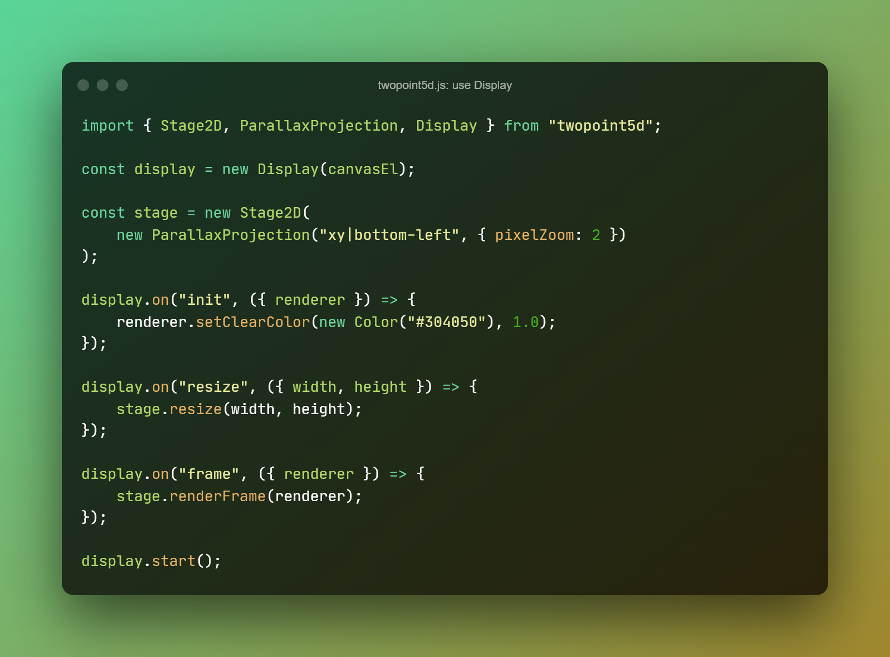
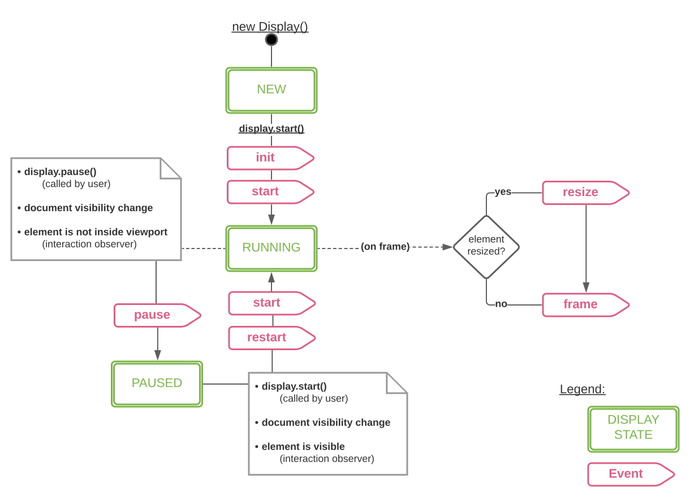

## State and Events

> NOTE(2022-03-15): all states and transitions from the diagram are implemented -
_except_ the _element-is-inside-viewport_ check -
the feature hasn't been built yet and actually hasn't been thought through to the end of whether it's needed at all.

