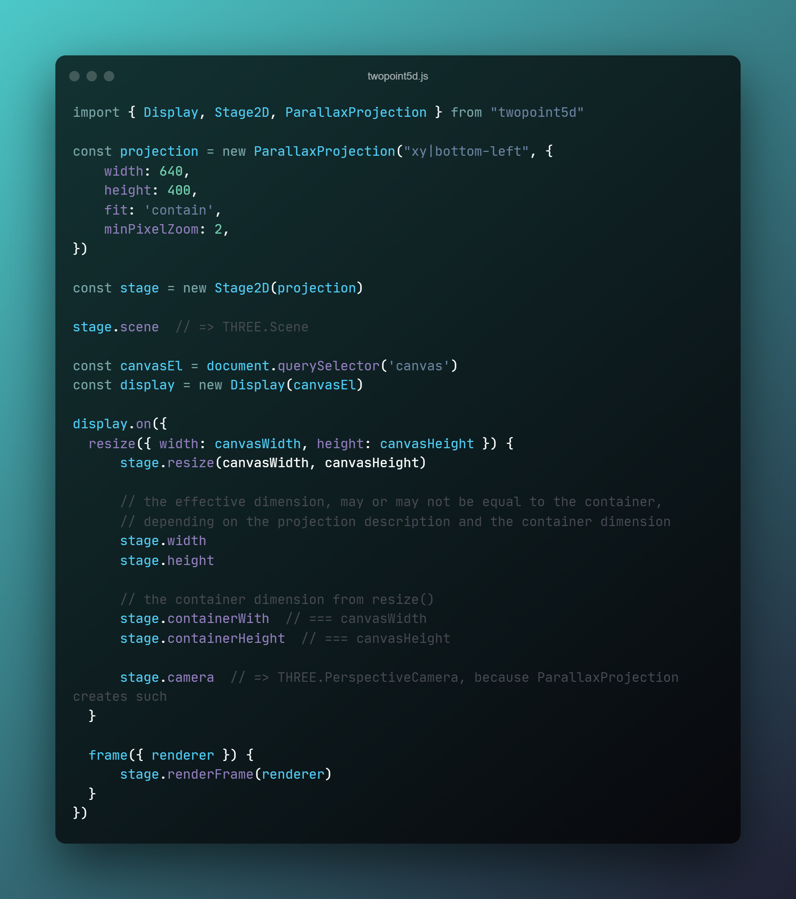

# Stage2D

:rocket: _responsive scenes for three.js_

- create responsive three.js scenes by describing a _projection_
- supports _orthogonal_ and _parallax_ (aka _perspective_) projections (more to come)
- :heavy_check_mark: api is stable and ready to use

> A *stage* is a facade for a *scene* with a *camera*. The camera is managed by means of a *projection* description.

Examples can be found here:
- [stage2d](../examples/vanilla/stage2d.html) (vanilla)
- [textured sprites](../examples/r3f/src/textured-sprites/textured-sprites.jsx) (react)
