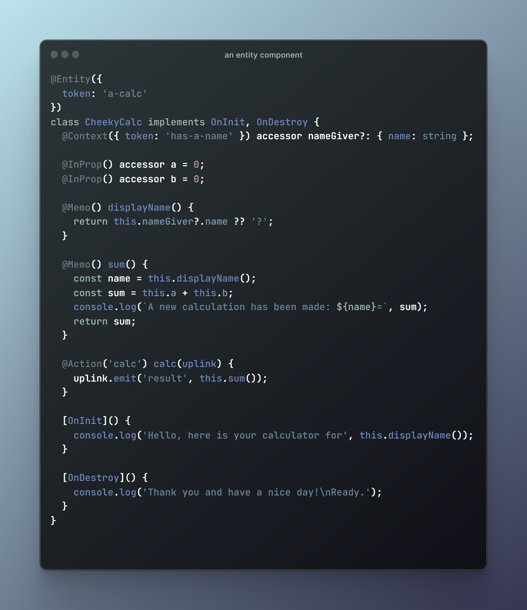
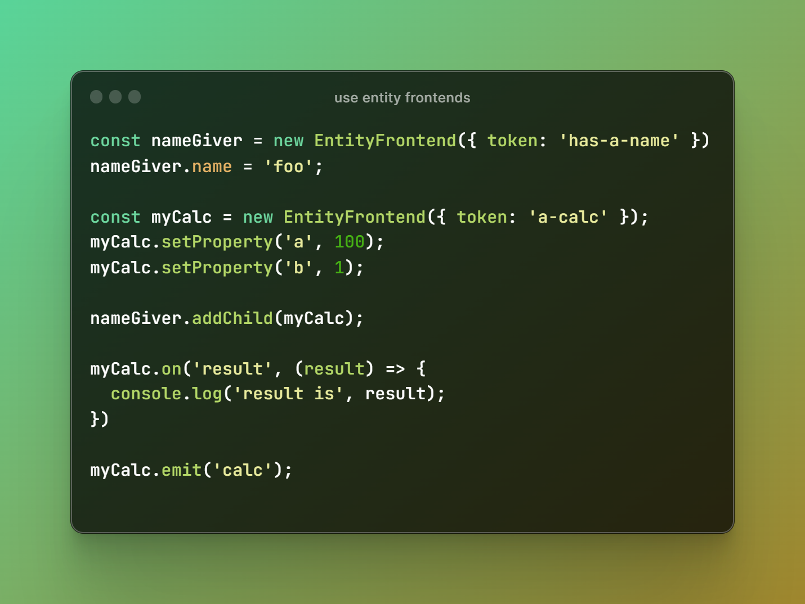

# @spearwolf/entity-verse

> a ~~framework~~ metaverse for your entities :rocket:

:warning: Attention!  The following content is more a sketch of ideas and tries to explore the vision of this framework. But by no means is this documentation complete or does it reflect the state of the implementation (for that you should better have a look at the test specs).

## Entity Components

**entity-verse** provides the user with a decorator based api that can be used to create _entity components_.
an _entity component_ has the following properties:
- there are any number of initial properties, aka `InProp`'s
- components can react to events and can trigger events themselves
- entity components have a _context_: components have a parent-child relationship to each other and thus live in a classical tree-like hierarchy
  - a compoennt can be assigned to a parent component (but does not have to)
  - a component can have one, none or multiple child components
- there is a clearly defined lifecycle model with callbacks (which the user can use if needed)
  - the creation of the components is not done directly by the user, but indirectly via an entity _kernel_ (more about this later)

## Entity Frontends

In order to use these entities, the user must create a _frontend_ for each entity. These frontends act as remote controllers for the actual entity.

> NOTE: the creation of frontends using the javascript api is only an intermediate step. the goal is to provide a web component based api for this purpose, or react components.

### HTML Custom Elements API

