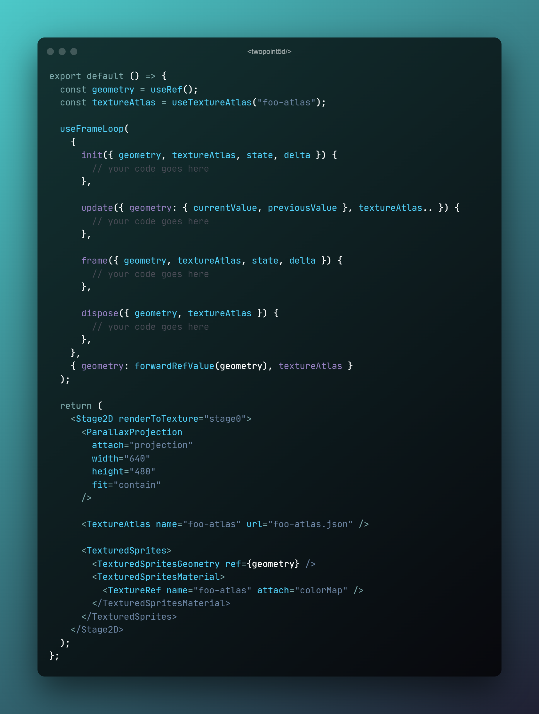

  
	 
  <em>a 2.5d realtime gfx library built with three.js, react and @react-three/fiber</em>

---

please see [../README](../../README.md) for a general description of this project.

---

The idea is roughly the following:

## API Overview

_is checked when implemented and ready to use_

### stages

- [x] `<Stage2D>`
  - [ ] `renderToTexture` property
  - [x] `<GetStage2D>`
  - [x] `useStage2D()`
  - [x] `useStageSize()`
  - [x] `useStageResize()`
- [ ] stage *director/composer* &rarr; stage *effects/layers*

### projections

- [x] `<ParallaxProjection>`
- [ ] `<OrthographicProjection>`
- [ ] `<IsometricProjection>`

### textures

- [x] `<AssetStore>`
- [x] `<TextureAtlas>`
- [x] `<TextureRef>`
- [x] `<TileSet>`
- [x] `<TileSetRef>`
- [x] `useTexture()`
- [x] `useTextureAtlas()`
- [x] `useTextureLoader()`
- [x] `useTileSet()`
- [x] `useTileSetLoader()`

### sprites

- [x] `<TexturedSprites>`
- [x] `<TexturedSpritesGeometry>`
- [x] `<TexturedSpritesMaterial>`
- [ ] `<AnimatedSprites>`
- [ ] `<AnimatedSpritesGeometry>`
- [ ] `<AnimatedSpritesMaterial>`

### map2D

- [x] `<RepeatingTilesProvider>`
- [x] `<Map2DLayer3D>`
- [x] `<Map2DTileSprites>`
- [x] `<TileSpritesGeometry>`
- [x] `<TileSpritesMaterial>`

### controls

- [x] `<PanControl2D>`

### utils

- [x] `useAsyncEffect()`
- [x] `useFrameLoop()`
- [x] `<ShaderChunks>`

have fun!
:rocket:
